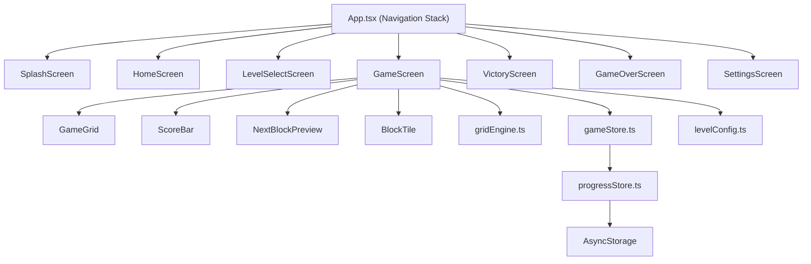

# X2 Global Blocks — Development Walkthrough

## Project Summary

Built a complete **X2 Global Blocks** merge puzzle game using **React Native + Expo** with **TypeScript**. The game features blocks that drop into a grid and merge when matching (2+2=4, 4+4=8...), with 40 levels of progressive difficulty.

**Brand**: AP Programming Tech  
**Package**: `com.approgrammingtech.x2globalblocks`

---

## Architecture Overview



---

## Files Created

### Core Engine
| File | Purpose |
|------|---------|
| [gridEngine.ts](file:///d:/CodePlay/x2-global-blocks/src/engine/gridEngine.ts) | Grid creation, block dropping, merge detection, cascading, gravity |
| [levelConfig.ts](file:///d:/CodePlay/x2-global-blocks/src/engine/levelConfig.ts) | 40 level definitions across 5 difficulty tiers |
| [scoreEngine.ts](file:///d:/CodePlay/x2-global-blocks/src/engine/scoreEngine.ts) | Score calculation, combo multipliers, star ratings |

### State Management
| File | Purpose |
|------|---------|
| [gameStore.ts](file:///d:/CodePlay/x2-global-blocks/src/store/gameStore.ts) | Zustand store for active game state (grid, score, blocks) |
| [progressStore.ts](file:///d:/CodePlay/x2-global-blocks/src/store/progressStore.ts) | AsyncStorage-backed progress (levels, stars, settings) |

### Screens (7 total)
| File | Purpose |
|------|---------|
| [SplashScreen.tsx](file:///d:/CodePlay/x2-global-blocks/src/screens/SplashScreen.tsx) | AP Programming Tech branded intro with floating particles |
| [HomeScreen.tsx](file:///d:/CodePlay/x2-global-blocks/src/screens/HomeScreen.tsx) | Main menu with neon floating blocks, Play/Levels/Settings |
| [LevelSelectScreen.tsx](file:///d:/CodePlay/x2-global-blocks/src/screens/LevelSelectScreen.tsx) | 40-level grid with stars, locks, difficulty grouping |
| [GameScreen.tsx](file:///d:/CodePlay/x2-global-blocks/src/screens/GameScreen.tsx) | Core gameplay with grid, HUD, pause modal |
| [VictoryScreen.tsx](file:///d:/CodePlay/x2-global-blocks/src/screens/VictoryScreen.tsx) | Trophy, confetti, stars, "REACH NEW GOALS" banner |
| [GameOverScreen.tsx](file:///d:/CodePlay/x2-global-blocks/src/screens/GameOverScreen.tsx) | Dramatic shake, stats, progress indicator |
| [SettingsScreen.tsx](file:///d:/CodePlay/x2-global-blocks/src/screens/SettingsScreen.tsx) | Audio/haptics toggles, stats, about section |

### Components
| File | Purpose |
|------|---------|
| [BlockTile.tsx](file:///d:/CodePlay/x2-global-blocks/src/components/BlockTile.tsx) | Color-coded animated block with merge glow |
| [GameGrid.tsx](file:///d:/CodePlay/x2-global-blocks/src/components/GameGrid.tsx) | Responsive grid with tap-to-drop column zones |
| [ScoreBar.tsx](file:///d:/CodePlay/x2-global-blocks/src/components/ScoreBar.tsx) | HUD with score, level, goal, moves/time |
| [NextBlockPreview.tsx](file:///d:/CodePlay/x2-global-blocks/src/components/NextBlockPreview.tsx) | Current + next block preview |
| [StarRating.tsx](file:///d:/CodePlay/x2-global-blocks/src/components/StarRating.tsx) | Animated 1-3 star display |

### Configuration
| File | Purpose |
|------|---------|
| [colors.ts](file:///d:/CodePlay/x2-global-blocks/src/constants/colors.ts) | Complete color palette, block colors, gradients |
| [App.tsx](file:///d:/CodePlay/x2-global-blocks/App.tsx) | Navigation stack with all routes |
| [app.json](file:///d:/CodePlay/x2-global-blocks/app.json) | Expo config with branding |
| [babel.config.js](file:///d:/CodePlay/x2-global-blocks/babel.config.js) | Babel + Reanimated plugin |

---

## Level System

40 levels across 5 difficulty tiers:

| Tier | Levels | Goals | Features |
|------|--------|-------|----------|
| 🌱 Beginner | 1-10 | 32-128 | Basic merges, classic mode |
| 🎯 Easy | 11-20 | 128-512 | Time limits, pre-placed blocks |
| 🔥 Medium | 21-30 | 512-2048 | Tight grids, combined constraints |
| 💀 Hard | 31-38 | 2048-4096 | Narrow grids, obstacles, speed runs |
| 👑 Expert | 39-40 | 4096-8192 | Combined time + move limits |

---

## How to Run

```bash
# Start the development server
cd d:\CodePlay\x2-global-blocks
npx expo start

# Run on Android device/emulator
npx expo run:android

# Build APK for distribution
eas build -p android --profile production
```

The Expo dev server is verified running on `http://localhost:8081`.

---

## What's Working
- ✅ Complete project scaffolding with TypeScript
- ✅ All 7 screens with animations
- ✅ Full game engine (grid, merge, cascade, gravity)
- ✅ 40 levels with progressive difficulty
- ✅ State management with Zustand
- ✅ Progress persistence with AsyncStorage
- ✅ Neon arcade visual theme
- ✅ Complete background music & sound effect integration using `expo-av`
- ✅ Expo dev server compiles successfully

## Next Steps
- Haptic feedback integration (expo-haptics)
- Android emulator testing
- APK build for Play Store
